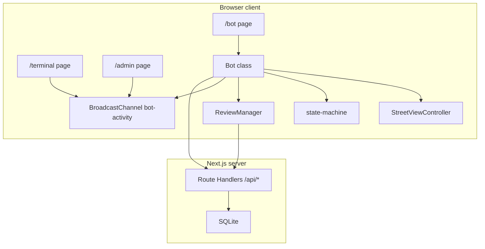

# Would Not Recommend — LLM handoff document

This document describes the **would-not-recommend** project so another engineer or LLM can work on the codebase without prior context. It reflects the repository as of its last update; verify file paths and behavior against the tree when in doubt.

---

## One-line summary

**Next.js 15** kiosk-style web app: an autonomous **Google Street View** “bot” that wanders a configured region (default: Den Haag retail bounds), periodically queries **Google Places** for nearby businesses, selects a **one-star** review, and **reads it aloud** (Web Speech API) with ambient audio and UI. Session/review metadata is persisted in **SQLite** (`better-sqlite3`). A separate **activity terminal** view mirrors bot actions via **`BroadcastChannel`** (same browser, two tabs).

---

## Tech stack

| Layer | Choice |
|--------|--------|
| Framework | Next.js 15 (App Router), React 19 |
| Styling | Tailwind CSS 4 |
| Maps | `@googlemaps/js-api-loader`, Maps **JavaScript** API — `streetView` library, `StreetViewPanorama` |
| Server data | **better-sqlite3**, DB file under `data/db/would-not-recommend.db` |
| Speech | `WebSpeechTTS` wrapper around `speechSynthesis` |
| Audio | Web Audio API (`AudioEngine` — ambient loops, ducking, SFX) |

---

## How to run

```bash
npm install
cp .env.example .env.local   # fill Google API keys
npm run dev                  # http://localhost:3000 → redirects to /bot
npm run build && npm start   # production
npm run typecheck
npm run lint
```

---

## Environment variables

Defined in `.env.example` (copy to `.env.local`).

| Variable | Role |
|----------|------|
| `NEXT_PUBLIC_MAPS_JAVASCRIPT_API_KEY` | **Maps JavaScript API** — loaded in the browser for Street View. Must be public (`NEXT_PUBLIC_*`). |
| `GEOCODING_API_KEY` | **Geocoding API** — server route `src/app/api/geocode/route.ts`. |
| `PLACES_API_KEY` | **Places API** — server route `src/app/api/places/route.ts`. Falls back to `GEOCODING_API_KEY` if unset. |
| `NEXT_PUBLIC_KIOSK_MODE` | If `true`, `/bot` auto-starts the bot after a short delay (no click overlay). |
| `NEXT_PUBLIC_ADMIN_PASSWORD` | Optional gate for `/admin`; empty = open in local dev. |

**Note:** The same Google Cloud key can be reused across variables if all required APIs are enabled and key restrictions (HTTP referrers for browser, etc.) match your deployment.

---

## App routes (user-facing)

| Path | Purpose |
|------|---------|
| `/` | Server redirect → `/bot` (`src/app/page.tsx`). |
| `/bot` | Main experience: Street View canvas, HUD, click-to-start (unless kiosk). Client-only bot via `useBot`. |
| `/terminal` | Monospace activity log; subscribes to `src/lib/bot-activity.ts` `BroadcastChannel`. **Requires `/bot` open in another tab** (same origin, same browser profile). |
| `/admin` | Dev/admin UI: bot tuning (`bot-settings` in `localStorage`), optional live activity mirror, health checks, recent reviews, teleport destination data. |

---

## HTTP API routes (`src/app/api`)

| Route | Role |
|-------|------|
| `GET/POST /api/log` | Session create/update, review log insert, aggregate stats (`src/lib/db.ts`). |
| `GET /api/log/recent` | Recent review rows for admin. |
| `GET /api/geocode` | Reverse geocode → city (and country for DB). |
| `GET /api/places` | Nearby Search + Place Details/reviews; filters for target rating/length. |
| `POST /api/screenshots` | Saves JPEG from canvas data URL per review. |
| `GET /api/health` | Key presence + DB ping (used by admin). |

---

## High-level architecture



- **`Bot`** (`src/engine/bot.ts`) orchestrates Street View, audio, TTS, teleportation, Places/review fetching, SQLite logging, and **activity posts** for the terminal.
- **`StreetViewController`** (`src/engine/street-view-controller.ts`) wraps `StreetViewPanorama`: periodic **`stepForward()`** along links while “walking,” optional wander POV float (rAF loop), scripted pans for review flow, teleport by lat/lng.
- **`state-machine`** (`src/engine/state-machine.ts`) pure transitions: `WANDER` → `DETECT` → `DELIVER` → `RETURN` → `WANDER`, with `TELEPORT` interrupt paths.
- **`ReviewManager`** (`src/engine/review-manager.ts`) caches nearby places, fetches reviews, hashes read text to avoid repeats.
- **`TeleportManager`** (`src/engine/teleport-manager.ts`) spawn/destination selection and “stuck” detection inside the wander region.
- **`bot-settings`** (`src/lib/bot-settings.ts`) tunable timing, wander region, link mode, review selection, Street View float — persisted in `localStorage`, hot-reload hooks in `Bot` where applicable.

---

## Bot states (`BotState` in `src/lib/types.ts`)

| State | Meaning |
|-------|---------|
| `WANDER` | Walking along Street View links; HUD mode “Searching”. |
| `DETECT` | Stopped, panning toward business, preparing review. |
| `DELIVER` | TTS reading the review; screenshot taken. |
| `RETURN` | Pan back to wander heading, then resume walking. |
| `TELEPORT` | Fade, jump to new coordinates (stuck, imagery fault, or interrupt). |

Events include `BUSINESS_DETECTED`, `DETECT_COMPLETE`, `DELIVER_COMPLETE`, `RETURN_COMPLETE`, `TELEPORT_*`, `STUCK_DETECTED`.

---

## Wander vs “many network requests”

- **Application steps:** `startWalking` uses `setInterval` to call `stepForward()` at **`wanderStepInterval`** (default **15s** from config unless overridden by bot settings) — not per-frame navigation.
- **Street View imagery:** Google’s viewer loads tiles/CDN assets (`streetviewpixels`, `ggpht.com`, etc.). **`setPov` at ~60 Hz** when **wander look float** is enabled can stress imagery; 429s are often **imagery/CDN throttling**, not your Places API call rate. Tuning: `wanderLookFloatEnabled` / sway in bot settings or `STREET_VIEW` defaults in `src/lib/config.ts`.

---

## Activity logging (`/terminal` and admin)

- Module: `src/lib/bot-activity.ts` — `postActivity(tag, lines)`, `subscribeActivity`.
- **`Bot`** emits structured lines: `SESSION`, `SEARCHING` (per successful wander **step**), `STOP` / `WALK`, `STATE` (once per state change, not `WANDER`), `REVIEW` (compact metadata + body), `TELEPORT`, etc., with **lat/lng/city** on movement-related tags where implemented.
- Messages are **not** persisted server-side for the terminal; refresh clears the view. **BroadcastChannel** does not cross browsers/machines.

---

## Persistence (`src/lib/db.ts`)

- **`review_log`**: per-review rows (session, coords, city, business, text, rating, TTS duration, screenshot filename).
- **`sessions`**: rolling stats per bot session id.
- **`countries_visited`**: deduplicated country list from geocode.

---

## Important file map

| Path | Role |
|------|------|
| `src/app/bot/page.tsx` | Main Street View UI shell. |
| `src/app/terminal/page.tsx` | Activity log UI. |
| `src/app/admin/page.tsx` | Settings + diagnostics. |
| `src/engine/bot.ts` | Core orchestration. |
| `src/engine/state-machine.ts` | State transitions and effect list. |
| `src/engine/street-view-controller.ts` | Panorama + walking + pans. |
| `src/hooks/useBot.ts` | React hook: single `Bot` instance lifecycle. |
| `src/lib/config.ts` | Defaults: timing, Hague region, Places/review filters, `STREET_VIEW` tuning. |
| `data/teleport-destinations.json` | Teleport targets (used with admin / `TeleportManager`). |

---

## Product / UX notes

- **Title / SEO:** `src/app/layout.tsx` — “Would Not Recommend”, Street View installation reading one-star reviews.
- **Visual layer:** `VisualEffects`, `HUD` show mode, coords, city, session timer, review counts.
- **Kiosk:** auto-start on `/bot` when `NEXT_PUBLIC_KIOSK_MODE=true`.

---

## Follow-up work (not exhaustive)

- Terminal across devices would need **SSE/WebSocket** or polling, not only `BroadcastChannel`.
- Rate limits / 429 on Google imagery: reduce POV update frequency, check Cloud quotas and key restrictions.
- Keep this document updated when adding routes, env vars, or major engine changes.

---

## Document maintenance

**Location:** `docs/llm-handoff/README.md`  
**Audience:** Future maintainers and LLM sessions — update when architecture or env surface changes materially.
